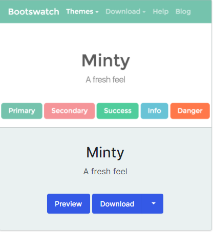

# Wedding App

The live version of the site is available [here](https://wedding-app-ms3.herokuapp.com/)

This project was created for my third Milestone Project with Code Institute in order to display my knowledge and understanding 
of HTML, CSS, Python, Flask and MongoDB.

This project is definitely the one I am most excited about creating because it is for my sister for her wedding. She asked me a couple 
of months ago to make her a site where her wedding guests could RSVP, register, log in and see all of the information they need to know 
about her big day as well as allowing them to submit any dietary requirements or accessibility issues. This site will allow her to relax 
in the leadup to her big day knowing that all the guests data will be stored in the one place for her to view rather than sending multiple 
emails to find out the information. She also wants a place where her and her fiancé can add updates about their big day and alert users 
by email that an update has been added.

This is my first project where I will be getting instructions from a client on the features and content needed on this site and I think it 
will be a great learning curve for what I can expect when I start working as a Web Developer.

---

## Table of Contents
* [User Experience](#User-Experience)
    * [The Strategy Plane](#The-Strategy-Plane)
        * [User stories](#User-Stories)
    * [The Scope Plane](#The-Scope-Plane)
    * [The Structure Plane](#The-Structure-Plane)
    * [The Skeleton Plane](#The-Skeleton-Plane)
        * [Wireframes](#Wireframes)
        * [Database Design](#Database-Schema)
    * [The Surface Plane](#The-Surface-Plane)
        * [Design](#Design)
            * [Font](#Font)
            * [Images](#Images)
            * [Colour Scheme](#colour-scheme)
* [Features](#Features)
    - [Future Features to Implement](#future-features-to-implement)
* [Technologies Used](#Technologies-Used)
    - [Languages](#languages)
    - [Libraries and Frameworkds](#libraries-and-frameworks)
    - [Tools](#tools)
* [Testing](#testing)
* [Deployment](#deployment)
    * [Initial Creation](#initial-creation)
    * [Deployment to Heroku](#deployment-to-heroku)
        - [Create the app on Heroku](#create-the-app-on-heroku)
        - [Connect Heroku to Github](#connect-heroku-to-github)
        - [Set environment variables](#set-environment-variables)
        - [Automatic Deployment](#automatic-deployment)
* [Credits](#credits)
    * [Content](#content)
    * [Media](#media)
    * [Acknowledgements](#acknowledgements)

--- 

## User Experience
### The Strategy Plane
Weddings can be extremely stressful to plan. There is so much to think about in the run up to the big day like the flowers, the table plans, 
the guests dietary requirements. The list goes on. For my sister, whose wedding is next September, she wanted a place where her guests could 
register, login, have access to all the information about their wedding and have the ability to add a variety of special requests ranging 
from dietary requirements to wanting to stay on the property in Italy.

This project was created for my sister Emma for her big day to help alleviate some of the stress. The aim is to provide a simple web 
application where wedding guests can add, edit and delete their specific requirements.

### User Stories
* As a user, I want to be able to easily navigate across the site so I can find the content quickly
* As a user, I want to view a pretty website with images of the wedding venue
* As a user, I want to be able to register an account so I can add any required information the bride might need
* As a user, I want to be able to update or delete the information I add
* As a logged in user, I want to be able to find out all the information about the wedding; the dates, the venue, the schedule
* As a user, I want to be informed when an update has been added to the site
* As a user, I want the website to be responsive across all devices

### The Scope Plane
#### Features
##### Site wide features
* Navbar entailing an anchor tag with "E&D" directing users back to the home page
* Navbar containing links to various different pages depending on the type of user
* Footer containing copyright information and a clipart of an olive branch above it
* Collapsible burger icon menu on mobile devices

##### Home Page
* Details of the wedding venue, dates and itinerary to people who have registered an account
* Contains a hero image with anchor tags to the register or log in pages to unregistered users
* Contains updates sections which have been added by an admin user
* Modal dialog box for delete functionality to add defensive programming(for admin users only) 

##### Accommodation page
* Contains text and photos providing logged in users information about the property and surrounding area
* Link to google maps 
* Link to property website

##### FAQ page
* Contains text detailing common questions and answers about the wedding

##### Preference and Edit Preference page
* CRUD functionality for guests preferences
* Contains information of their chosen preferences
* Buttons to edit or delete their own preference
* Admin users can view all guests preferences here
* Admin users can delete anyones preferences
* Modal dialog box for delete functionality to add defensive programming(for admin users only) 

##### Update page
* CRUD functionality for updates
* Form where admin user can add updates into fields which will render to index.html for logged in users to view
* Flask mail set up to email all non-admin users when an update has been added to the site 

##### Other Features
* Register, login and logout functionality
* MongoDB to store wedding guest information and user login details
* 404 and 500 Error pages 

##### Future Features to Implement
* A page where guests can add all their photos from the trip
* A sitewide password so only guests that have been emailed this password can enter and register 
* Add extra fields into the guest preferences database 
* A forgot password functionality
* A remember me functionality so guests only have to log in once
* Implement Google Maps API for the property

[Back to top](#Table-of-Contents)
### The Structure Plane
User Story:
 As a user, I want to be able to easily navigate across the site so I can find the content quickly

Acceptance Criteria:
* Navigation bar to be displayed across all pages on the site
* Navigation links all render the correct pages
* Mobile users will see a burger icon for the dropdown menu

Implementation:
A navigation bar will be displayed on the top of each page of the site.
The navigation links will each bring the user to the appropriate pages.
In mobile view, a collapsible burger icon will detail the menu items to the user.

This is a list of the navigation items that will be visible when not logged in:
* Home - index.html
* Log In - login.html
* Register - register.html

This is a list of the navigation items that will be visible while logged in:
* Home - index.html
* Accommodation - accommodation.html
* Preferences - preferences.html
* FAQ - faq.html
* Update - update.html (visible to admin users)
* Log Out -(Redirects to Log In page)

User Story:
 As a user, I want to view a pretty website with images of the wedding venue

Acceptance Criteria:
* Images to be displayed across the site

Implementation:
There is a large hero image of an olive tree stretching across the entire width of 
the screen. There are three different images on the accommodation.html page displaying 
different highlights of the region. On each page (just above the footer), there is an 
icon of an olive branch. The wedding venue is set amongst 4,000 olive trees so the 
client wanted this as a recurring theme across the site.

User Story:
 As a user, I want to be able to register an account so I can add any required information the bride might need

Acceptance Criteria:
* Register page
* Registered users are able to add their preference 

Implementation:
A register page will be implemented that enables users to set up an account on the website. An account will be 
needed to access any of the wedding details on index.html. Only account holders will be able to access the 
accommodation and faq pages. On the registration page, the user will be asked to enter their first name, 
last name, email address and a password. All of this information is stored in MongoDB in a collection called 
user. The email address must be unique as it is used to verify the session user. If a user tries to enter an 
email that has already been registered, a message will flash saying "Sorry this email has already been used".

Once the registration is successful, the user will automatically be logged in and will be able to add their 
preference under the "Preference" anchor tag in the navigation bar. Here, the user will be asked how many 
people are in their party, whether they require accommodation, whether they have any dietary requirements, 
the date of arrival and if they have anything to add.

User Story:
 As a user, I want to be able to update or delete the information I add

Acceptance Criteria:
* User must be able to create, edit and delete their preference on the site

Implementation:
A preference page will be implemented and will be visible to users that are logged in on the navigation 
menu. The user can only have one entry which they can create, edit or delete. If the user creates an entry 
and then decides to edit it, the options they previously selected will still be shown. If the user decides 
to delete their preference they will be prompted to add their preference again. Their information is stored 
in MongoDB in a collection called guest_info. 

User Story:
As a logged in user, I want to be able to find out all the information about the wedding; the dates, the venue, the schedule

Acceptance Criteria:
* When users are logged in, they must be able to access all the information about the wedding on the 'Home', 'Accomodation' and 'FAQ' pages

Implementation:
I will implement an if session user statement in the base.html to ensure that only users that are logged in can view the navigation links in the header.
When a user is registered and logged in, they will be able to view all the information regarding the wedding such as venue, dates etc. As an extra precaution 
for security, I will add a decorator function to any functions that are specific to a user that is logged in.

User Story:
 As a user, I want to be informed when an update has been added to the site

Acceptance Criteria:
* User must be notified when a new update is added

Implementation:
I will implement the flask-mail extension and use it in the add update function to send an email to each non-admin user whenever a new update is added to 
the site 

User Story:
 As a user, I want the website to be responsive across all devices

Acceptance Criteria:
* The page content should be responsive and be displayed clearly on all devices

Implementation:
Material Design for Bootstrap will be used for this site with suitable column sizes in place for different devices as well as media queries being use in my resposive.css file.

[Back to top](#Table-of-Contents)

### The Skeleton Plane
#### Wireframes
The desktop version wireframes for this project can be found [here](Wireframes/Desktop) and the mobile version can be found [here](Wireframes/Mobile).
The client changed their mind throughout the process of building the site as can be seen if you view the original wireframes [here](Wireframes/OldWireframes)

#### Database Schema
The application uses three collections named user, guest_info and update. The following are made up examples 
<pre>Collection: user 
{
    firstName: John
    lastName: Doe
    email: johndoe@gmail.com
    password: abcd1234
    is_admin: false
}
</pre>
<pre>Collection: guest_info
{
    number_of_party: 1 
    require_accommodation: yes
    dietary_restrictions: yes
    dietary_restrictions_description: Gluten free
    arrival_date: 08/09/2022
    add_note: Really looking forward to it
    created_by: johndoe@gmail.com
}</pre>
<pre>Collection: update
{
    date: 2021/06/10
    title: Big News
    description: Accomodation is now fully confirmed! Pack your bags!
    created_by: admin@123.com
}</pre>

[Back to top](#Table-of-Contents)

### The Surface Plane
#### Design
##### Font
Using the <a href="https://fontpair.co/">Font Pair</a> website, I chose two complimentary fonts; <a href="https://fonts.google.com/specimen/Asap">Asap</a> 
for the headings, and <a href="https://fonts.google.com/specimen/Roboto">Roboto</a> for the rest of the text.

##### Images
All the images on the site are of either an olive branch or on the 'Accomodation' page of the local area. This is to keep in theme with the Italian wedding and the 
fact that the property is on an olive farm.

##### Colour Scheme
I used [BootsWatch](https://bootswatch.com/) Minty theme for my Bootstrap website. Please see the image below for the colour scheme:

[Back to top](#Table-of-Contents)
---
## Technologies Used
### Languages
- [HTML5](https://en.wikipedia.org/wiki/HTML5) 
    - The project uses **HTML** as the main language for structuring the content
- [CSS3](https://en.wikipedia.org/wiki/CSS) 
    - The project uses **CSS** for styling the sites content
- [Python](https://www.python.org/)
    - This project uses **Python** for the backend of the website

### Libraries and Frameworks
- [Flask](https://flask.palletsprojects.com/) was used in conjunction with Python as a micro web framework
- [Material Design for Bootstrap](https://mdbootstrap.com/) 
    - This was used Bootstrap to help in the design and layout of the website in conjunction with HTML, CSS and Python
- [Font Awesome](https://fontawesome.com/) 
    - This was used to collect the social media icons for this site
- [Google Fonts](https://fonts.google.com/) 
    - This was used to import the two fonts for this site, Asap and Roboto

### Tools
- [GitHub](https://github.com/) 
    - This is the hosting site where I first created the repository for this webpage and also where the live site is deployed from 
- [Git](https://git-scm.com/) 
    - This is the version control software used where can I commit and push the updated information to the hosting website GitHub
- [MongoDB](https://www.mongodb.com/)
    - This was used for the database
- [BootsWatch](https://bootswatch.com/)
    - This was used as a theme for Bootstrap
- [PyMongo](https://pymongo.readthedocs.io/)
    - This was used as a tool to allow interaction between Python and MongoDB
- [Heroku](https://id.heroku.com)
    - This was used to deploy the live website
- [Balsamiq](https://balsamiq.com/) 
    - This was used to create my rough wireframes
- [Favicon](https://favicon.io/)
    - This was used to create the sites Favicon of an olive branch
- [Font Pair](https://fontpair.co/) 
    - This was used to choose complementary fonts
- [Tiny JPG](https://tinyjpg.com/) 
    - This was used this to compress my images
- [ClipArtKey](https://www.clipartkey.com/)
    - This was used to download the olive branch image used above the footer of the site
- [Chrome DevTools](https://developers.google.com/web/tools/chrome-devtools)
    - This was used to inspect elements on the page and help debug issues involving the 
    site layout
- [PEP8 Online](http://pep8online.com/)
    - This was used to check for PEP8 compliance
- [W3C CSS validator](https://jigsaw.w3.org/css-validator/)
    - This was used to test the CSS code for any errors
- [W3C Markup validator](https://validator.w3.org/)
    - This was used to test the HTML code for any errors
- [Jinja](https://jinja.palletsprojects.com/en/3.0.x/)
    - This was used as a web template engine for the Python language 
- [Web Accessibility](https://www.webaccessibility.com/)
    - This was used to test the accessibility of this site for users with disabilities

[Back to top](#Table-of-Contents)

---

## Testing
The testing documentation can be found [here](TESTING.md)

---

## Security 

## Deployment 
### Initial Creation
Wedding App was first created by completing the following steps on GitHub:
1. Open [Github](https://github.com/) page up in browser
2. Log in using your username and password
3. Click the "New" green button to the left-hand side repository section
4. Click template dropdown menu and select the "Code Institute Full Template"
5. Enter name of project "WeddingApp-MS3"
6. Click "Create repository"
7. Click the green "Gitpod" button ONCE to redirect to the Gitpod workspace
8. Open via [Gitpod Workspaces](https://gitpod.io/workspaces/) only, from then on

Throughout development, three primary commands were used with the CLI [Git](https://git-scm.com/) and were as follows :

- "git add" followed by the file name you wish to stage or "git add ." stages all unstaged files
- "git commit -m" followed by a detailed comprehensive comment pertaining to the changes made since the previous commit
- "git push" makes all changes visible on the GitHub Repo

### Deployment to Heroku
#### Setup files
- First, I had to tell Heroku which applications I required to run my app, as well as the dependencies. I did this 
by setting up a requirements.txt file and a Procfile.
- To set up the requirements.txt file, I typed the following command into the command line: 
pip3 freeze --local > requirements.txt
- My requirements.txt file contains the following: 
blinker==1.4 
click==8.0.0 
dnspython==2.1.0 
Flask==2.0.0 
Flask-Mail==0.9.1 
Flask-PyMongo==2.3.0 
itsdangerous==2.0.0 
Jinja2==3.0.0 
MarkupSafe==2.0.0 
pymongo==3.11.4 
Werkzeug==2.0.0 
 

- To create my Procfile, I typed the following command: 
echo web: python app.py > Procfile

#### Create the app on Heroku
1. Navigate to [Heroku](https://www.heroku.com) and login using your credentials
2. Click on the "New" button in the top right hand corner and select create new app
3. Enter the app name and select "Europe" for the region

#### Connect Heroku to Github
1. Click on the "Deploy" tab and select "GitHub", then "Connect to GitHub"
2. Box appears to find a github repository to connect to
3. Enter the repo name created on Github, in this case "WeddingApp-MS3"
4. Then click search
5. When the correct repo has been found, click the button to connect

#### Set environment variables
In Heroku, click on the "Settings" tabe and click "Reveal Config Vars" button to add the following information:
1. key: IP, value: 0.0.0.0
2. key: MONGO_DBNAME, value: database name(wedding_app)
3. key: MONGO_URI, value: (This value is found in Mongo DB by accessing "clusters" then "connect" then "connect to your application". You have to 
add in your own database name and password also)
4. key: PORT, value: 5000
5. key: SECRET_KEY, value: (Used to keep the site secure)

#### Automatic deployment
Click on the "deploy" tab and choose the branch you wish to deploy. Then, click "Enable Automatic Deploys"

### Local Deployment
To run my project locally, the steps are as follows:
1. Navigate to the GitHub [Repo](https://github.com/shielh/WeddingApp-MS3)
2. Click on the 'Code' dropdown button
3. Copy the Git UTL from the HTTPS box by clicking the clipboard icon, or else select to download the ZIP file
4. When using the Git URL, you can just open a new terminal in your preferred IDE and type the 'git clone' command 
in the CLI and paste your copied URL
5. A clone of your project will then be created locally on your PC
6. If you decided to download the ZIP file instead, unpackage it locally and open in your preferred IDE

[Back to top](#Table-of-Contents)

## Credits

--- 
### Content
- The decorator function for ensuring there's an active user or an admin was taken from [here](https://flask.palletsprojects.com/en/2.0.x/patterns/viewdecorators/)
- The flask session timeout was created using the help from this [StackOverflow Link](https://stackoverflow.com/questions/11783025/is-there-an-easy-way-to-make-sessions-timeout-in-flask)
- The flask mail functionality was created with the help of this [YouTube Tutorial](https://www.youtube.com/watch?v=48Eb8JuFuUI), this [documentation](https://flask-mail.readthedocs.io/en/latest/) 
and this [tutorial](https://pythonbasics.org/flask-mail/) 
- I used [this](https://flask.palletsprojects.com/en/1.1.x/patterns/errorpages/) resource to help make my custom error pages
- I used this [WikiPedia Link](https://en.wikipedia.org/wiki/Lake_Trasimeno) to get information on the area for the Accommodation page
- I used the [La Dogana Site](https://agriturismodogana.it/) to retrieve information about the property to put on the site
- I used this [link](https://codeconvey.com/footer-at-bottom-of-page-but-not-fixed/) to help resolve my problem with my footer sticking to the bottom
---

### Media
- The photos used on this site were obtained from [Unsplash](https://unsplash.com/).

---
### Acknowledgements
A huge thank you to:
- My brother Gregory for his endless patience and guidance throughout this project
- My mentor Felipe Souza Alarcon for his help and motivation throughout this project. He was always so positive and had great suggestions!
- My sister Emma for trusting me to create her wedding website and for being a great first client to work with
- My peers in various Slack channels for always getting back to me quickly with questions or feedback.
--- 

[Back to top](#Table-of-Contents)