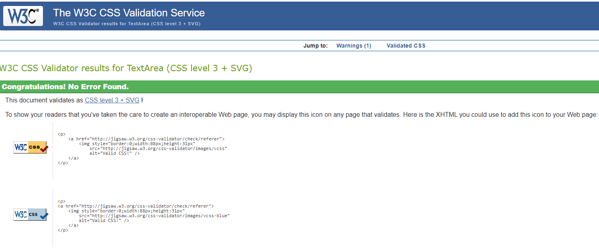
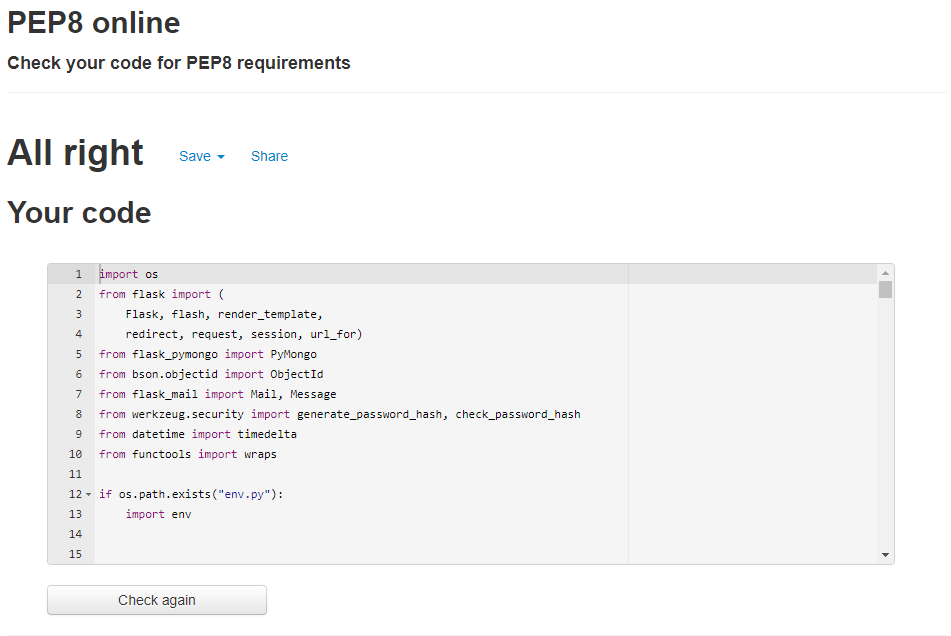

## Automated Testing
### Responsivity across devices
- I checked the site across [Google Chrome](https://www.google.com/intl/en_ie/chrome/), [Mozilla Firefox](https://www.mozilla.org/en-US/firefox/new/), [Safari](https://www.apple.com/safari/) 
and [Opera](https://www.opera.com/) and all pages were completely responsive  with the layout remaining intact.
- Using [Chrome DevTools](https://developers.google.com/web/tools/chrome-devtools), (to open I right-clicked anywhere on my website and clicked "Inspect" or clicked "F12" on the keyboard), I ran my site in mobile/tablet display 
across the following devices: Galaxy Note 3, Galaxy S III, Moto G4, iPhone 4, Galaxy S5, Pixel 2, Pixel 2 XL, iPhone 5/SE, iPhone 6/7/8, iPhone 6/7/8 Plus, iPhone X, iPad, iPad Pro. Everything 
ran normally on these devices. 
I also sent my site to some friends and family to open on their phones. 

When displaying the home page on an iPad Pro, the media query for the divide-content class wasn't working correctly. To address this issue, I changed the media query to a 
max-width: 1023px

---
### HTML CSS and Python Testing
1. W3C HTML Validator
- I opened [W3C HTML Validator](https://validator.w3.org/) and selected the "Validate by Direct Input" option and pasted the html content in separately for each of the 
fourteen html files, then clicked "Check".
- Initially when I ran the check, I had included the jinja templates which caused errors but when I tested the code after removing the jinja templates, it passed!

2. Similarly, I ran the code through the [W3C CSS Validator](https://jigsaw.w3.org/css-validator/) 
- I selected the "by Direct Input" option and pasted my style.css and responsive.css code in
- I received the message:
**CSS: Pass **

3. Python PEP8 Compliant
I copy and pasted the code in my app.py file into the text box on [PEP8 site](http://pep8online.com/) and it returned this message of no errors:

