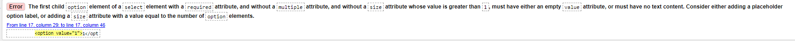
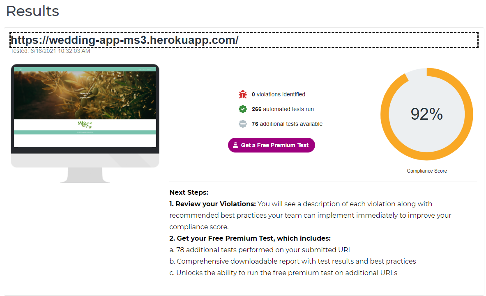
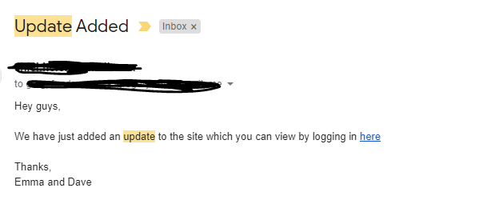
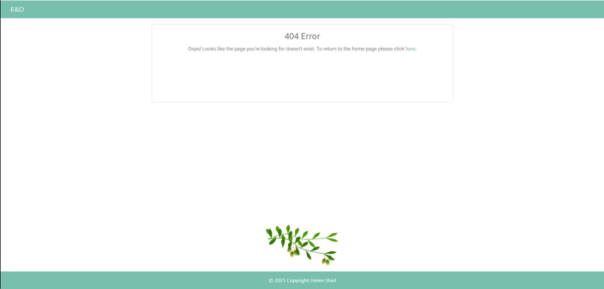
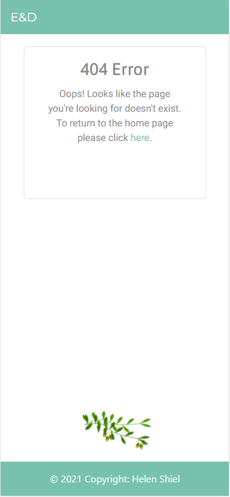
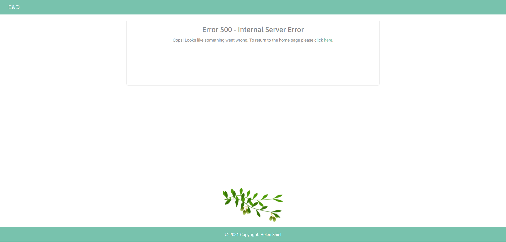
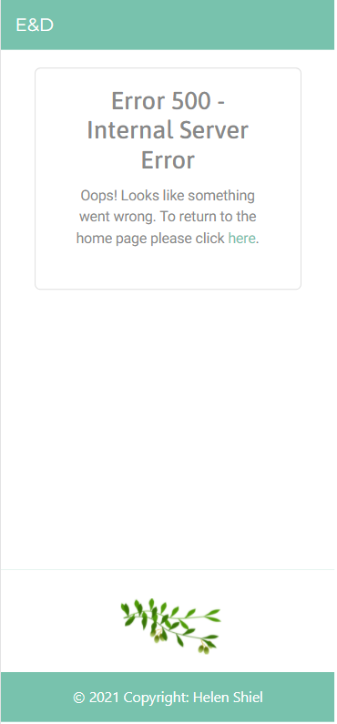
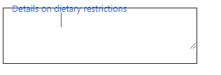

## Table of Contents
* [Automated Testing](#Automated-Testing)
    * [Responsivity across devices](#Responsivity-across-devices)
    * [HTML CSS and Python Testing](#HTML-CSS-and-Python-Testing)
    * [Web Accessibility](#Web-Accessibility)
    * [The Structure Plane](#The-Structure-Plane)
    * [The Skeleton Plane](#The-Skeleton-Plane)
* [Manual Testing](#Manual-Testing)
    * [Test Case 1](#Test-Case-1)
    * [Test Case 2](#Test-Case-2)
    * [Test Case 3](#Test-Case-3)
    * [Test Case 4](#Test-Case-4)
    * [Test Case 5](#Test-Case-5)
    * [Test Case 6](#Test-Case-6)
    * [Test Case 7](#Test-Case-7)
    * [Test Case 8](#Test-Case-8)
    * [Test Case 9](#Test-Case-9)
    * [Test Case 10](#Test-Case-10)
    * [Test Case 11](#Test-Case-11)
    * [Test Case 12](#Test-Case-12)
    * [Test Case 13](#Test-Case-13)
* [Issues and Solutions](#Issues-and-Solutions)

## Automated Testing
### Responsivity across devices
* As a user, I want the website to be responsive across all devices
This test allowed me to ensure the user story for responsivity was met
    - I checked the site across [Google Chrome](https://www.google.com/intl/en_ie/chrome/), [Mozilla Firefox](https://www.mozilla.org/en-US/firefox/new/), [Safari](https://www.apple.com/safari/) 
    and [Opera](https://www.opera.com/) and all pages were completely responsive  with the layout remaining intact.
    - Using [Chrome DevTools](https://developers.google.com/web/tools/chrome-devtools), (to open I right-clicked anywhere on my website and clicked "Inspect" or clicked "F12" on the keyboard), I ran my site in mobile/tablet display 
    across the following devices: Galaxy Note 3, Galaxy S III, Moto G4, iPhone 4, Galaxy S5, Pixel 2, Pixel 2 XL, iPhone 5/SE, iPhone 6/7/8, iPhone 6/7/8 Plus, iPhone X, iPad, iPad Pro. Everything 
    ran normally on these devices. 
    I also sent my site to some friends and family to open on their phones. 

    One error I noticed occuring was when displaying the home page on an iPad Pro, the media query for the divide-content class wasn't working correctly. To address this issue, I changed the media query to a 
    max-width: 1023px

---
### HTML CSS and Python Testing
1. W3C HTML Validator
- I opened [W3C HTML Validator](https://validator.w3.org/) and selected the "Validate by URI" option and paste each of the fourteen html pages in separately, 
then clicked "Check".
- All pages passed except for 'add_preference.html' which showed the following error:

---
2. Similarly, I ran the code through the [W3C CSS Validator](https://jigsaw.w3.org/css-validator/) 
- I selected the "by Direct Input" option and pasted my style.css and responsive.css code in
- I received the message:

**CSS: Pass**

---
3. Python PEP8 Compliant
I copy and pasted the code in my app.py file into the text box on [PEP8 site](http://pep8online.com/) and it returned this message of no errors:

---

### Web Accessibility
I tested the sites homepage on [Web Accessibility](https://www.webaccessibility.com/) to ensure the site was able to be used by people with disabilities 
and received the following result:

---

[Back to top](#Table-of-Contents)

## Manual Testing
I conducted tests on all user stories and features on the site:
For all test cases, I opened the web application via this [link](https://wedding-app-ms3.herokuapp.com/)

### Test Case 1

* As a user, I want to be able to easily navigate across the site so I can find the content quickly

**Description:** 
Verify all navlinks work in the header and footer across all pages, for users that aren't logged in, are logged in and are admin users

**Steps:** 
Users that aren't logged in:
1. Navigate to the [site](https://wedding-app-ms3.herokuapp.com/)
2. Click on the navbar brand 'E & D'
3. Click on the 'Home' page
4. Click on the 'Log in' Page
5. Click on the 'Register' page
6. Click on the 'Login' and 'Register' links in the hero-image on the 'Home' page
7. Repeat steps for navlinks from each html page

Users that are logged in:
1. Log in to your account
2. Click on the 'Home' page
3. Click on the 'Accommodation' page
4. Click on the 'FAQ' page
5. Click on the 'Preferences' page
6. Click on the 'Log Out' button
7. Repeat steps for navlinks from each html page

Differences for users that are set up as admin:
1. Sign in as admin
2. Click 'Preferences' page - redirects to different page from the one regular users are brought to
3. Click 'Update' 
4. Repeat steps for navlinks from each html page

**Expected Result:** 
All links in header have correct, functioning links

**Actual Result:** 
All links in header have correct, functioning links

**Pass/Fail:**  
Pass

---

[Back to top](#Table-of-Contents)

### Test Case 2

* As a user, I want to view a pretty website with images of the wedding venue

**Description:** 
Verify all images and clipart are shown on the application

**Steps:** 
1. Open application
2. Click across all pages, and observe the olive branch above the footer
2. Click on the 'Home' page, observe the hero image of the olive branch, the clipart separating sections
3. Click on the 'Accommodation' page and observe the clipart under the heading and the three images beside the text areas
4. Click on the 'FAQ' page and observe the clipart under the heading

**Expected Result:** 
All images and clipart are visible 

**Actual Result:** 
All images and clipart are visible 

**Pass/Fail:** 
Pass

---

* As a user, I want to be able to register an account so I can add any required information the bride might need

### Test Case 3

**Description:** 
Verify registration functionality performs as expected 

**Steps:** 
1. Navigate to sites 'Register' page
2. Observe the input fields; First Name, Last Name, Email and Password
3. Enter input fields with your relavant information
4. Click Register button
5. Check MongoDB to ensure new entry has been added to user collection

**Expected Result:** 
- Registration successful
- New user added to MongoDB

**Actual Result:** 
- Registration successful
- New user added to MongoDB

**Pass/Fail:** 
Pass

---

### Test Case 4

**Description:** 
Verify registration functionality performs as expected when a user inputs incorrect (such as email address has already been used) or null data

**Steps:** 
1. Navigate to sites 'Register' page
2. Observe the input fields; First Name, Last Name, Email and Password
3. Enter input fields with information you already registered with
4. Try click 'Register' without inputting information to any of the fields
5. Try inputting the information with the incorrect format

**Expected Result:** 
Registration will not be successful

**Actual Result:** 
Registration will not be successful

**Pass/Fail:** 
Pass

---

[Back to top](#Table-of-Contents)

### Test Case 5

**Description:** 
Verify register users can add their preferences

**Steps:** 
1. Click 'Register' button on register.html page with correct information inputted
2. You should be brought to Guest Preferences page
3. Select your preferences
4. Click 'Add Preferences' button
5. Check MongoDB to ensure new entry has been added to guest_info collection

**Expected Result:** 
- Preferences added successfully
- New guest_info entry added to MongoDB 

**Actual Result:** 
- Preferences added successfully
- New guest_info entry added to MongoDB 

**Pass/Fail:** 
Pass

---

### Test Case 6
* As a user, I want to be able to update or delete the information I add

**Description:** 
Verify users can view, edit and delete the preferences they add

**Steps:** 
1. Navigate to 'Log In' page 
2. Log in to account
3. Navigate to 'Preferences' page (assuming they were already filled in after registering)
4. Ensure preferences selected previously are visible on the page
5. Click 'Edit' button 
6. Ensure previously selected options are still selected
7. Edit preferences and submit
8. Verify edited choices are now displaying on page and changes have been made in MongoDB
9. Click 'Delete' button 
10. Ensure modal appears to confirm your choice to delete
11. Ensure preference has been deleted from MongoDB

**Expected Result:** 
Users can view, update and delete the preference they added

**Actual Result:** 
Users can view, update and delete the preference they added

**Pass/Fail:** 
Pass

--- 
[Back to top](#Table-of-Contents)

### Test Case 7

* As a logged in user, I want to be able to find out all the information about the wedding; the dates, the venue, the schedule

**Description:** 
Verify when users are logged in they can view wedding information on index.html, accommodation.html and faq.html

**Steps:** 
1. Register an account
2. Sign in 
3. Click onto 'Home' page and view 
4. Click into 'Accommodation' page and view
5. Click into 'FAQ' page and view

**Expected Result:** 
You should be able to view content about the wedding

**Actual Result:** 
You are able to view content about the wedding

**Pass/Fail:** 
Pass

---

### Test Case 8

* As a user, I want to be informed when an update has been added to the site

**Description:** 
Verify email is sent to users when an update is added

**Steps:** 
1. Create a non admin account with your own email that you can check
2. Then log in as Admin
3. Navigate to 'Update' page
4. Fill in date, title and description
5. Click 'Add Update' button
6. Check email account

**Expected Result:** 
You should receive and email telling you an update has been added

**Actual Result:** 
You receive an email telling you an update has been added

**Pass/Fail:** 
Pass

[Back to top](#Table-of-Contents)

---

### Test Case 9

Error 404 page

**Description:** 
Verify Error 404 page is displayed when navigating to a page that does not exist

**Steps:** 
1. Search for  https://wedding-app-ms3.herokuapp.com/doesnotexist
2. Click enter

**Expected Result:** 
404 page should be displayed

**Actual Result:** 
404 page is displayed

**Pass/Fail:** 
Pass

---

### Test Case 10

Error 500 page

**Description:** 
Verify Error 500 page is displayed when an internal server error occurs

**Steps:** 
1. Set debug to False on app.py
2. Raise an exception in function of choice with string "I am broken"
3. Navigate to page where function is used

**Expected Result:** 
500 page should be displayed

**Actual Result:** 
500 page is displayed

**Pass/Fail:** 
Pass

---

### Test Case 11

**Description:** 
Verify all routes are functioning correctly while signed out, signed in and as admin

**Steps:** 
1. While logged out, click the URL and attempt to access all routes including:
    - /home
    - /accommodation
    - /faq
    - /register
    - /login
    - /logout
    - /view_preferences
    - /get_guest_info
    - /add_preference
    - /edit_preference
    - delete_preference
    - /update
    - /add_update
    - /edit_update
    - /delete_update

2. Repeat testing all routes, while logged in
3. Repeat testing all routes, while logged in as admin

**Expected Result:** 
All routes function as expected

**Actual Result:** 
For all users (logged out, logged in and admin), searching the add_preference route resulted in a 405 error. This is because this function only contains a "POST" method.
For logged in users (incl admin), when I searched Log in and Register routes it brought me to the pages even though I was already logged in. To fix this, I created a new 
decorator for must not be logged in which redirected logged in users to the home page if they attempted to log in again or re-register.

**Pass/Fail:** 
Initial Fail, but then Pass

---
### Test Case 12

**Description:** 
Verify site times out after 30 minutes of inactivity

**Steps:** 
1. Register an account
2. Sign in 
3. Remain inactive for 30 minutes
4. Click a navlink accesible only to a logged in user such as 'Accommodation'

**Expected Result:** 
You should be redirected to login page

**Actual Result:** 
You are redirected to login page

**Pass/Fail:** 
Pass

---
### Test Case 13

**Description:** 
Verify all flash messages are appearing correctly on pages

**Steps:** 
1. Navigate to the site
2. Register and ensure flash message appears
3. Logout and ensure flash message appears
4. Login and ensure flash message appears
5. Enter incorrect password and ensure flash message appears
6. Enter incorrect email and ensure flash message appears
7. Add preferences and ensure flash message appears
8. Update your preferences and ensure flash message appears
9. Delete your preference and ensure flash message appears
10. Add an update (as an admin) and ensure flash message appears
11. Edit an update and ensure flash message appears
12. Delete an update and ensure flash message appears

**Expected Result:** 
You should see all relevant flash messages

**Actual Result:** 
You see all relevant flash messages

**Pass/Fail:** 
Pass

---

[Back to top](#Table-of-Contents)

## Issues and Solutions
- A bug I faced later in development was my text area inputs would begin wherever I clicked in the box as opposed to the beginning of the box. This led 
to data being saved in MongoDB with trailing whitespace at the beginning on the string. Please see the image below:

To resolve this issue, I had to have the closing 'textarea' tag directly after the opening tag

- I encountered another issue where a person that was logged in could view the admin preference page with all the guests information. I had an error in my decorator function 
where I had written: if session["is_admin"] which was checking if the attribute is present in the dictionary which it is for all users. I then changed the code to session.get("is_admin) 
which secured the page to admin users only

- When creating my edit pages for both updates and preferences, I found they weren't picking up the responsive.css styling I had implemented for form cards. In smaller devices, 
the form should have increased in its width. I hadn't used jinja templating in my href for the style link and hadn't included "../" at the beginning of the path. I changed the 
href to "{{ url_for('static', filename='css/responsive.css') }}" and everything fell back in place.

- While doing last minute checks of my site, I discovered that when I was attempting to delete either an update or a preference (as an admin user), where there were multiple entries, it would 
delete the oldest entry no matter what delete button I pressed. After inspecting the code and the elements in great detail, I discovered that the id that was being called in the modal box wasn't 
specific to the ObjectID of the entry. So I had to change the targetdata id and id in the modal box to include the ObjectID of the specific entry using jinja templating.

[Back to top](#Table-of-Contents)